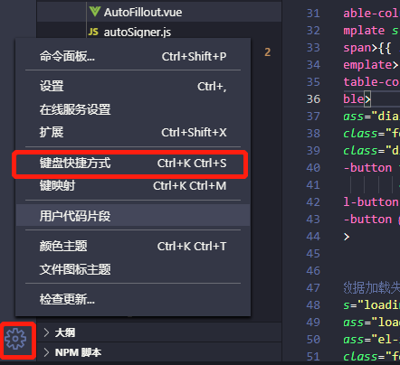

# VOCode快捷键
### 常用
```
Ctrl + B                            收启菜单栏
Ctrl + `                            收启控制台
Ctrl + Shift + T                    打开上一次关闭的窗口
Ctrl + F                            本页搜索
Ctrl + Shift + F                    全局搜索
Ctrl + H                            本页搜索和替换
Ctrl + C                            复制一行
Alt + Shift+ 上/下箭头               复制并黏贴到上/下一行，光标并随  
Alt + 上/下箭头                      移动当前行向上/下
Ctrl + T                            匹配文件名打开文件
Ctrl + G                            跳转到某一行
Ctrl + Backspace                    删除前一个单词
Ctrl + Shift + k                    删除一行         
Ctrl + Shift + 左/右箭头             逐个选择文本
Ctrl + Shift + PgUp/PgDown          将编辑窗口向左、右移动
Ctrl + Shift + L                    在匹配文本后批量填加光标
Ctrl + Alt + 上/下箭头               给当前列的上/下添加光标
Alt + Shift + 鼠标上/下拖动          给当前列的上/下添加光标
```
### 不常用
```
- Ctrl + Shift + Home/End           选择到顶/底部内容
- Ctrl + Home/End                   移动到顶/底部内容
```
### 如遇到快捷键不生效，可以进行修改

### 结尾
```
作者：陈会武
           ——文章不定期跟新，敬请关注，谢谢！
```